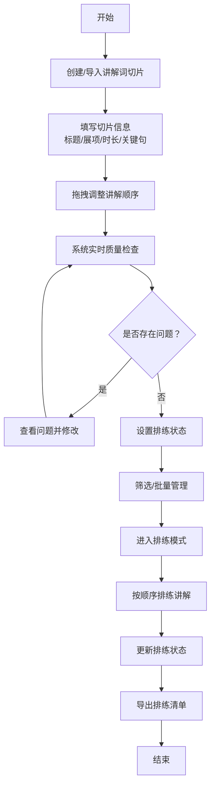

## 1. 产品概述

展览讲解员讲解词管理系统，帮助讲解员高效整理讲解词切片、调整顺序、管理排练状态，提供智能质量检查和沉浸式排练模式，所有数据本地存储无需后端。

- 目标用户：博物馆、展览馆、景区讲解员
- 核心价值：提升讲解词整理效率，确保讲解质量，辅助排练准备

## 2. 核心功能

### 2.1 用户角色

| 角色 | 注册方式 | 核心权限 |
|------|----------|----------|
| 讲解员 | 无需注册，本地使用 | 完整功能使用权限 |

### 2.2 功能模块

1. **讲解词切片管理**：创建、编辑、删除切片，维护标题、关联展项、建议时长、关键句、易错提醒、备用说法、排练状态
2. **筛选与搜索**：按展项、状态、时长范围、提醒类型多维度筛选
3. **顺序调整**：拖拽调整讲解顺序，支持复制切片为备用版本
4. **批量操作**：批量标记"待排练""已熟悉""需缩短""临时跳过"
5. **实时统计**：总时长实时计算，质量检查（相邻关键句重复、单段过长、备用说法缺失、跳过后衔接断点）
6. **排练模式**：按顺序展示当前片段、下一片段、剩余时长，计时提醒
7. **数据管理**：本地存储、导出排练清单

### 2.3 页面详情

| 页面名称 | 模块名称 | 功能描述 |
|-----------|-------------|---------------------|
| 主页面 | 顶部工具栏 | 新增切片、筛选条件、批量操作、导出、排练模式入口 |
| 主页面 | 统计面板 | 总时长、切片数量、质量检查警告提示 |
| 主页面 | 切片列表 | 可拖拽排序的切片卡片，支持多选、编辑、复制、删除 |
| 主页面 | 质量检查面板 | 展示所有检测到的问题，点击定位 |
| 排练模式 | 当前片段展示 | 放大显示当前讲解内容、时长倒计时 |
| 排练模式 | 下一片段预览 | 预览即将讲解的内容 |
| 排练模式 | 进度指示 | 整体排练进度、剩余时长 |

## 3. 核心流程

## 4. 用户界面设计

### 4.1 设计风格

- **主色调**：深靛蓝 #1e3a5f 作为主色，搭配琥珀橙 #f59e0b 作为强调色
- **辅助色**：成功绿 #10b981、警告黄 #f59e0b、错误红 #ef4444、信息蓝 #3b82f6
- **中性色**：石板灰系列（slate-50 到 slate-900）
- **按钮风格**：圆角 6px，悬停有微妙阴影和色阶变化
- **字体**：展示字体使用 "Noto Serif SC"，正文字体使用 "Noto Sans SC"
- **布局风格**：卡片式布局，清晰的信息层级，左侧筛选 + 主内容区 + 右侧检查面板
- **图标**：Lucide React 线性图标，保持统一风格

### 4.2 页面设计概述

| 页面名称 | 模块名称 | UI Elements |
|-----------|-------------|-------------|
| 主页面 | 顶部工具栏 | 深蓝色背景，白色文字，按钮悬停变亮，搜索框圆角设计 |
| 主页面 | 切片卡片 | 白色卡片，阴影层次，拖拽时提升阴影，状态标签彩色边框 |
| 主页面 | 质量检查面板 | 浅灰背景，问题条目带图标和颜色区分，可点击展开详情 |
| 排练模式 | 全屏展示 | 深色背景，大号字体，倒计时突出显示，过渡动画流畅 |
| 排练模式 | 进度条 | 底部渐变进度条，清晰标记当前位置 |

### 4.3 响应性

- 桌面端优先设计（1280px+）
- 平板端：隐藏右侧检查面板，改为抽屉式
- 移动端：筛选条件折叠，卡片纵向堆叠，操作按钮底部固定
- 触摸交互优化：拖拽有触觉反馈，点击区域 ≥ 44px

### 4.4 动画效果

- 页面加载：卡片错落淡入（staggered fade-in）
- 拖拽排序：流畅的位置过渡动画
- 状态变更：颜色渐变 + 轻微缩放反馈
- 排练模式切换：淡入淡出过渡
- 警告提示：轻微抖动动画吸引注意
