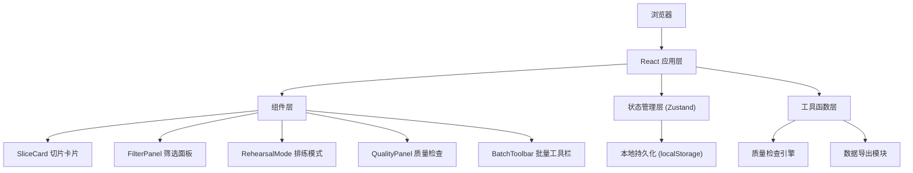
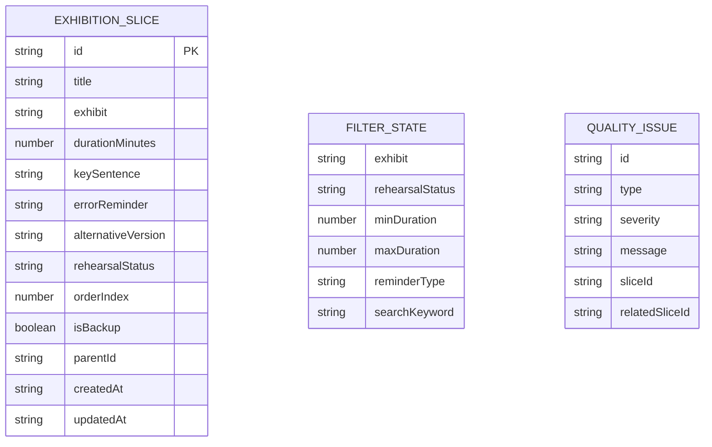

## 1. 架构设计



## 2. 技术描述

- **前端框架**：React@18 + TypeScript@5
- **构建工具**：Vite@5
- **样式方案**：TailwindCSS@3
- **状态管理**：Zustand@4
- **拖拽库**：@dnd-kit/core + @dnd-kit/sortable
- **图标库**：lucide-react
- **数据存储**：浏览器 localStorage
- **初始化方式**：使用 react-ts 模板初始化 Vite 项目

## 3. 数据模型

### 3.1 实体关系图



### 3.2 类型定义

```typescript
type RehearsalStatus = 'pending' | 'familiar' | 'needShorten' | 'skipped';

interface ExhibitionSlice {
  id: string;
  title: string;
  exhibit: string;
  durationMinutes: number;
  keySentence: string;
  errorReminder: string;
  alternativeVersion: string;
  rehearsalStatus: RehearsalStatus;
  orderIndex: number;
  isBackup: boolean;
  parentId?: string;
  createdAt: string;
  updatedAt: string;
}

interface Filters {
  exhibit: string;
  rehearsalStatus: string;
  minDuration: number;
  maxDuration: number;
  reminderType: string;
  searchKeyword: string;
}

interface QualityIssue {
  id: string;
  type: 'duplicate' | 'tooLong' | 'missingAlternative' | 'transitionGap';
  severity: 'warning' | 'error';
  message: string;
  sliceId: string;
  relatedSliceId?: string;
}

interface AppState {
  slices: ExhibitionSlice[];
  filters: Filters;
  selectedIds: string[];
  qualityIssues: QualityIssue[];
  isRehearsalMode: boolean;
  currentRehearsalIndex: number;
}
```

## 4. 项目结构

```
src/
├── components/
│   ├── SliceCard.tsx          # 切片卡片组件
│   ├── SliceEditor.tsx        # 切片编辑器
│   ├── FilterPanel.tsx        # 筛选面板
│   ├── BatchToolbar.tsx       # 批量操作工具栏
│   ├── QualityPanel.tsx       # 质量检查面板
│   ├── StatsBar.tsx           # 统计状态栏
│   ├── RehearsalMode.tsx      # 排练模式组件
│   └── RehearsalTimer.tsx     # 排练计时器
├── hooks/
│   ├── useLocalStorage.ts     # 本地存储 hook
│   ├── useQualityCheck.ts     # 质量检查 hook
│   └── useDragAndDrop.ts      # 拖拽 hook
├── store/
│   └── useSliceStore.ts       # Zustand 状态管理
├── types/
│   └── index.ts               # TypeScript 类型定义
├── utils/
│   ├── qualityChecker.ts      # 质量检查引擎
│   ├── exportUtils.ts         # 导出工具函数
│   └── timeUtils.ts           # 时间处理工具
├── data/
│   └── mockData.ts            # 示例数据
├── App.tsx                    # 主应用组件
├── main.tsx                   # 入口文件
└── index.css                  # 全局样式
```

## 5. 核心功能实现方案

### 5.1 拖拽排序
使用 @dnd-kit/sortable 实现，通过 verticalListSortingStrategy 处理垂直列表排序，拖拽结束后更新 orderIndex 字段。

### 5.2 质量检查引擎
实时监听 slices 变化，运行检查规则：
- 相邻切片 keySentence 相似度检测（Levenshtein 距离）
- 单段时长 > 10 分钟标记为过长
- alternativeVersion 为空标记缺失
- 被跳过切片前后的内容衔接检查

### 5.3 本地持久化
使用 Zustand persist middleware，将状态自动序列化存储到 localStorage，页面刷新后自动恢复。

### 5.4 排练模式
全屏遮罩展示，使用 requestAnimationFrame 实现精确计时器，支持暂停、继续、上一个、下一个操作。

### 5.5 导出功能
生成纯文本或 Markdown 格式的排练清单，支持浏览器下载。
